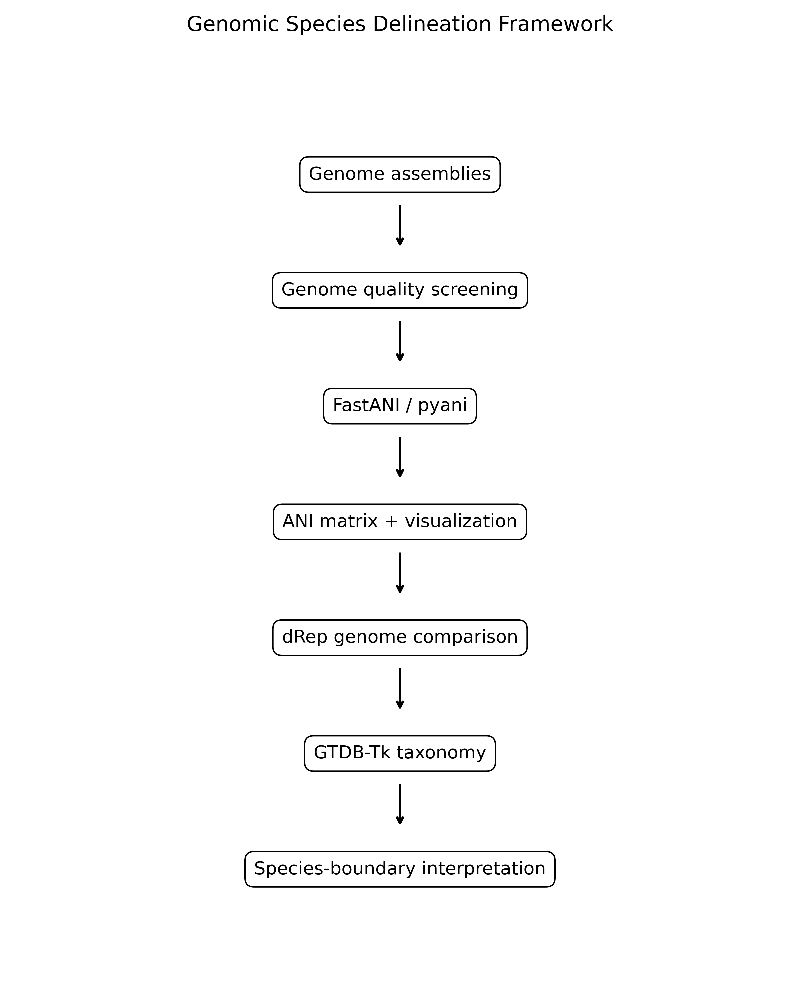

 # Genomic Species Delineation Framework

**A reproducible framework for microbial species delineation using Average Nucleotide Identity (ANI), genome similarity, dereplication, taxonomy, and phylogenomic evidence.**

---

## Overview

The increasing availability of microbial whole-genome sequences has transformed microbial taxonomy, systematics, and comparative genomics. Traditional approaches based on morphology, physiology, biochemical assays, and 16S rRNA gene similarity often lack sufficient resolution to distinguish closely related taxa. Whole-genome sequencing has therefore become the foundation of modern microbial species delineation.

This repository provides a reproducible framework for genome-based species assessment using established tools including **FastANI**, **pyani**, **dRep**, and **GTDB-Tk**. The goal is not simply to calculate ANI values, but to place genome similarity within a broader framework of taxonomy, genome quality assessment, dereplication, and phylogenomic interpretation.

---

## Scientific Background

### The Challenge of Defining Microbial Species

Unlike sexually reproducing eukaryotes, bacteria and archaea do not conform easily to the Biological Species Concept. Horizontal gene transfer, recombination, ecological specialization, and genome plasticity complicate the identification of universally accepted species boundaries.

Historically, microbial species delineation relied on DNA–DNA Hybridization (DDH), where strains sharing ≥70% DDH were generally considered members of the same species (Goris et al., 2007). While influential, DDH is labor-intensive, difficult to reproduce, and unsuitable for large-scale genomic studies.

The emergence of whole-genome sequencing enabled the development of Average Nucleotide Identity (ANI), which has largely replaced DDH as the preferred genomic metric for species delineation (Richter & Rosselló-Móra, 2009).

### Average Nucleotide Identity (ANI)

ANI measures the average nucleotide similarity between homologous genomic regions shared by two genomes.

Numerous studies have demonstrated that ANI values of approximately **95–96%** correspond closely to the traditional **70% DDH threshold**, making ANI the most widely used operational criterion for bacterial and archaeal species delineation (Richter & Rosselló-Móra, 2009; Jain et al., 2018).

ANI is widely used for:

* Species boundary assessment
* Genome similarity analysis
* Taxonomic validation
* Comparative genomics
* Genome dereplication

### Why ANI Alone Is Not Enough

Although ANI is extremely informative, species delineation should never rely exclusively on a numerical threshold.

Interpretation should consider:

* Genome completeness
* Genome contamination
* Assembly quality
* Horizontal gene transfer
* Recombination
* Ecological divergence
* Phylogenetic placement
* Taxonomic context

Accordingly, ANI should be interpreted as one component of an integrative genomic taxonomy framework.

---

## Framework Workflow



The framework follows seven major stages:

1. Obtain genome assemblies
2. Assess genome quality
3. Calculate pairwise genome similarity
4. Generate ANI matrices and visualizations
5. Compare and dereplicate genomes
6. Assign taxonomy
7. Interpret species boundaries

---

## Repository Structure

```text
Genomic-Species-Delineation-Framework/
├── docs/
├── example_outputs/
├── figures/
├── scripts/
├── toy_genomes/
├── README.md
├── requirements.txt
└── LICENSE
```

---

## Software Included

| Software | Purpose                                           |
| -------- | ------------------------------------------------- |
| FastANI  | Rapid ANI estimation for large genome collections |
| pyani    | ANIb-based ANI calculation and visualization      |
| dRep     | Genome comparison and dereplication               |
| GTDB-Tk  | Genome-based taxonomic classification             |

---

## Tested Status

This repository was tested locally on Linux/WSL environments.

Successfully tested workflows:

* FastANI v1.34 all-vs-all genome comparison
* FastANI matrix generation
* FastANI visualization workflow
* pyani ANIb workflow
* dRep compare workflow

Generated outputs include:

```text
example_outputs/fastani/
example_outputs/pyani/
example_outputs/drep/
figures/fastani_real_heatmap.png
figures/fastani_real_barplot.png
```

Note: dRep dereplication is documented but was not demonstrated using the synthetic toy genomes because CheckM-based quality assessment requires realistic microbial genome assemblies.

---

## Installation

```bash
conda create -n species_delineation \
  -c conda-forge \
  -c bioconda \
  python=3.10 \
  fastani \
  pyani \
  drep \
  gtdbtk \
  pandas \
  matplotlib \
  seaborn \
  blast \
  -y

conda activate species_delineation
```

---

## Quick Start

### FastANI

```bash
bash scripts/01_make_fastani_lists.sh
bash scripts/02_run_fastani_all_vs_all.sh
python scripts/08_parse_fastani_and_plot.py
```

### pyani

```bash
bash scripts/03_run_pyani.sh
```

### dRep

```bash
bash scripts/04_run_drep_compare.sh
```

### GTDB-Tk

```bash
bash scripts/06_run_gtdbtk_classify_example.sh
```

---

## Species Boundary Interpretation

| ANI (%) | Interpretation            |
| ------- | ------------------------- |
| 99–100  | Nearly identical strains  |
| 96–99   | Generally same species    |
| 95–96   | Species boundary zone     |
| 94–95   | Borderline classification |
| <94     | Usually different species |

ANI interpretation should always be integrated with:

* Genome quality
* Contamination estimates
* Phylogenetic evidence
* Taxonomic assignment
* Ecological information
* Gene content analyses

---

## Example Results

The included toy dataset demonstrates genome similarity patterns across multiple levels of relatedness.

| Genome Pair                                  | FastANI (%) | Interpretation           |
| -------------------------------------------- | ----------- | ------------------------ |
| A_reference vs B_same_species_98ANI          | 97.85       | Likely same species      |
| A_reference vs C_boundary_95ANI              | 95.04       | Near species boundary    |
| A_reference vs D_related_below_species_92ANI | 92.29       | Likely different species |
| A_reference vs E_distant_85ANI               | 81.82       | Distant lineage          |

### FastANI Heatmap


### FastANI Pairwise Comparison


---

## Recommended Research Workflow

For real microbial genome projects:

1. Assess genome quality using CheckM, CheckM2, BUSCO, or GTDB-Tk summaries.
2. Remove incomplete or contaminated assemblies.
3. Run FastANI for rapid all-vs-all genome similarity screening.
4. Use pyani when detailed matrix visualization is required.
5. Use dRep for comparison and dereplication of large genome collections.
6. Use GTDB-Tk for taxonomy-aware classification.
7. Interpret ANI together with phylogeny, ecology, and gene content.

---

## Limitations

This repository is intended as a reproducible educational and research framework.

Important limitations include:

* The included genomes are synthetic demonstration datasets.
* ANI does not directly measure evolutionary history.
* ANI should not replace phylogenetic analysis.
* Borderline ANI values require careful interpretation.
* Formal species descriptions require multiple independent lines of evidence.
* Genome quality can strongly influence similarity estimates.

---

## References

1. Konstantinidis KT, Tiedje JM. 2005. Genomic insights that advance the species definition for prokaryotes. PNAS 102:2567–2572.

2. Goris J et al. 2007. DNA–DNA hybridization values and their relationship to whole-genome sequence similarities. IJSEM 57:81–91.

3. Richter M, Rosselló-Móra R. 2009. Shifting the genomic gold standard for the prokaryotic species definition. PNAS 106:19126–19131.

4. Jain C et al. 2018. High throughput ANI analysis of 90K prokaryotic genomes reveals clear species boundaries. Nature Communications 9:5114.

5. Olm MR et al. 2017. dRep: a tool for fast and accurate genomic comparisons. ISME Journal 11:2864–2868.

6. Parks DH et al. 2020. A complete domain-to-species taxonomy for Bacteria and Archaea. Nature Biotechnology 38:1079–1086.

---

## Author

**Muhammad Bilal**
PhD Student, Biological and Biomedical Sciences
Oakland University, Rochester, Michigan, USA


---

## License

MIT License
