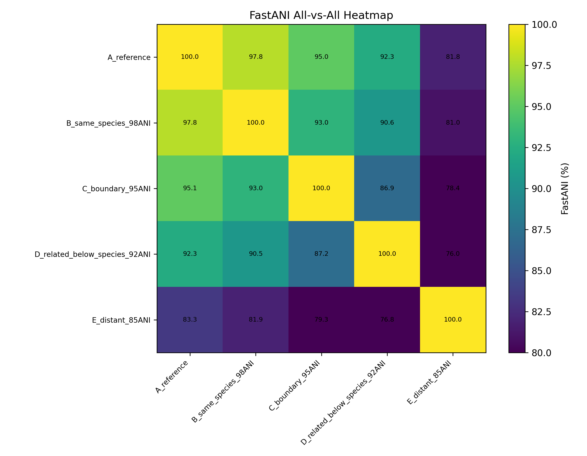
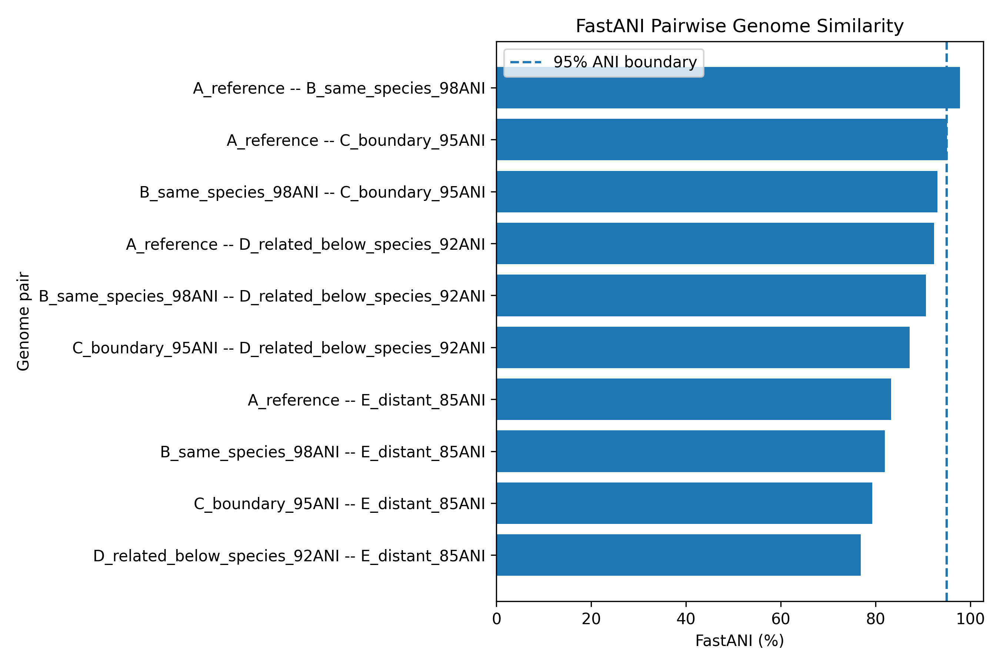

# Genomic Species Delineation Framework

A reproducible tutorial repository for microbial genome ANI analysis using established tools: **FastANI**, **pyani**, **dRep**, and **GTDB-Tk**.

This repository is designed for PhD-level microbial genomics, comparative genomics, and pangenomics workflows. It is not a new ANI algorithm. Instead, it provides a clean, reproducible, and interpretable tutorial for performing ANI screening with established community tools.

---

## Why This Repository?

Average Nucleotide Identity (ANI) is one of the most widely used genome-based measures for microbial species delimitation. In practice, ANI helps answer questions such as:

- Are these genomes likely from the same species?
- Which genomes are near the species boundary?
- Which genomes should be dereplicated before pangenome analysis?
- Do genome clusters match phylogenetic or GTDB taxonomy?

A common bacterial species boundary is approximately **95–96% ANI**, but interpretation should always consider genome quality, taxonomy, phylogeny, and biological context.

---

## Repository Structure

```text
ANI-Analysis-Tutorial/
├── README.md
├── requirements.txt
├── LICENSE
├── toy_genomes/
│   ├── A_reference.fna
│   ├── B_same_species_98ANI.fna
│   ├── C_boundary_95ANI.fna
│   ├── D_related_below_species_92ANI.fna
│   └── E_distant_85ANI.fna
├── scripts/
│   ├── 01_make_fastani_lists.sh
│   ├── 02_run_fastani_all_vs_all.sh
│   ├── 03_run_pyani.sh
│   ├── 04_run_drep_compare.sh
│   ├── 05_run_drep_dereplicate.sh
│   ├── 06_run_gtdbtk_classify_example.sh
│   └── 07_plot_example_ani_matrix.py
├── example_outputs/
│   ├── example_ani_matrix.csv
│   └── example_pairwise_ani_results.csv
├── figures/
│   ├── example_ani_heatmap.png
│   └── example_ani_barplot.png
└── docs/
    ├── ANI_INTERPRETATION_GUIDE.md
    └── SOFTWARE_COMPARISON.md
```

---

## Example ANI Heatmap



---

## Example Pairwise ANI Barplot



---

## Installation

This tutorial assumes a Linux, macOS, WSL, or HPC environment.

### Python plotting dependencies

```bash
pip install -r requirements.txt
```

### Recommended conda environment

```bash
conda create -n ani_tutorial -c conda-forge -c bioconda python=3.10 fastani pyani drep gtdbtk pandas matplotlib -y
conda activate ani_tutorial
```

Note: GTDB-Tk requires a large reference database and database configuration before real use.

---

# Part 1: FastANI

FastANI is recommended for rapid ANI screening of many genome assemblies.

## Step 1: Make query/reference lists

```bash
bash scripts/01_make_fastani_lists.sh
```

This creates:

```text
example_outputs/fastani/query_list.txt
example_outputs/fastani/reference_list.txt
```

## Step 2: Run all-vs-all FastANI

```bash
bash scripts/02_run_fastani_all_vs_all.sh
```

The core command is:

```bash
fastANI \
  --ql example_outputs/fastani/query_list.txt \
  --rl example_outputs/fastani/reference_list.txt \
  -o example_outputs/fastani/fastani_all_vs_all.tsv \
  -t 4
```

## FastANI Output Columns

Typical FastANI output contains:

```text
query_genome    reference_genome    ANI    fragments_mapped    total_fragments
```

Interpretation:

- ANI = nucleotide identity estimate
- fragments mapped = number of query fragments matching reference
- total fragments = total query fragments considered
- low fragment mapping can make ANI less reliable

---

# Part 2: pyani

pyani is useful for detailed ANI comparison and graphical summaries.

Run:

```bash
bash scripts/03_run_pyani.sh
```

Classic pyani command:

```bash
average_nucleotide_identity.py \
  -i toy_genomes \
  -o example_outputs/pyani \
  -m ANIb \
  -g \
  --workers 4
```

Depending on your pyani version, the command may be:

```bash
pyani --help
```

or:

```bash
average_nucleotide_identity.py --help
```

Always check the installed version before running.

---

# Part 3: dRep

dRep is useful when you have many genomes and want to compare or dereplicate them.

## Compare genomes

```bash
bash scripts/04_run_drep_compare.sh
```

Core command:

```bash
dRep compare example_outputs/drep/drep_compare \
  -g toy_genomes/*.fna \
  -p 4
```

## Dereplicate genomes

```bash
bash scripts/05_run_drep_dereplicate.sh
```

Core command:

```bash
dRep dereplicate example_outputs/drep/drep_dereplicate \
  -g toy_genomes/*.fna \
  -p 4 \
  -sa 0.95
```

Use dereplication before pangenome analysis when many genomes are nearly identical.

---

# Part 4: GTDB-Tk

GTDB-Tk is used for bacterial and archaeal genome classification against the GTDB taxonomy.

Example:

```bash
bash scripts/06_run_gtdbtk_classify_example.sh
```

Core command:

```bash
gtdbtk classify_wf \
  --genome_dir toy_genomes \
  --out_dir example_outputs/gtdbtk/gtdbtk_classify \
  --extension fna \
  --cpus 4
```

GTDB-Tk is especially useful when ANI interpretation must be connected to standardized taxonomy.

---

## ANI Interpretation

| ANI (%) | Interpretation |
|---:|---|
| 99–100 | nearly identical strains |
| 96–99 | likely same species |
| 95–96 | common species boundary zone |
| 94–95 | borderline; inspect carefully |
| <94 | likely different species |

Important: ANI should be interpreted with genome quality, phylogeny, taxonomy, and biological context.

---

## Example Results

The included example matrix is pedagogical and shows expected interpretation patterns:

| Pair | ANI (%) | Interpretation |
|---|---:|---|
| A_reference vs B_same_species_98ANI | 98.2 | likely same species |
| A_reference vs C_boundary_95ANI | 95.5 | near species boundary |
| A_reference vs D_related_below_species_92ANI | 92.5 | likely different species |
| A_reference vs E_distant_85ANI | 85.5 | distant genome |

---

## Real Research Workflow

For real genome projects:

1. Check genome quality using CheckM, BUSCO, or GTDB-Tk summaries.
2. Remove poor-quality or highly contaminated genomes.
3. Run FastANI for rapid all-vs-all screening.
4. Use pyani for detailed matrix/visual summaries when needed.
5. Use dRep if dereplication or representative genome selection is needed.
6. Use GTDB-Tk to connect ANI patterns with standardized taxonomy.
7. Interpret ANI with phylogeny and pangenome structure.

---

## When To Use Which Tool?

| Goal | Recommended tool |
|---|---|
| fast pairwise ANI | FastANI |
| all-vs-all ANI matrix and plots | pyani |
| large genome dereplication | dRep |
| taxonomy-aware genome classification | GTDB-Tk |
| pangenome preprocessing | FastANI + dRep |

---

## Author

Muhammad Bilal  
Department of Biological Sciences  
Oakland University  
Rochester, Michigan, USA

---

## Citation

If you use or adapt this tutorial, please cite:

Bilal M. *ANI-Analysis-Tutorial: A reproducible workflow for microbial genome ANI screening using FastANI, pyani, dRep, and GTDB-Tk*. GitHub repository.

---

## License

MIT License

---

## Tested Status

This repository was tested locally on WSL/Linux using FastANI v1.34.

Successfully generated:

- `example_outputs/fastani/fastani_all_vs_all.tsv`
- `example_outputs/fastani/fastani_matrix.csv`
- `example_outputs/fastani/fastani_pairwise_interpreted.csv`
- `figures/fastani_real_heatmap.png`
- `figures/fastani_real_barplot.png`

The pyani workflow is included as an optional tutorial section. In the tested environment, pyani required additional dependency/version adjustment and was therefore not used for the final demonstrated outputs.
