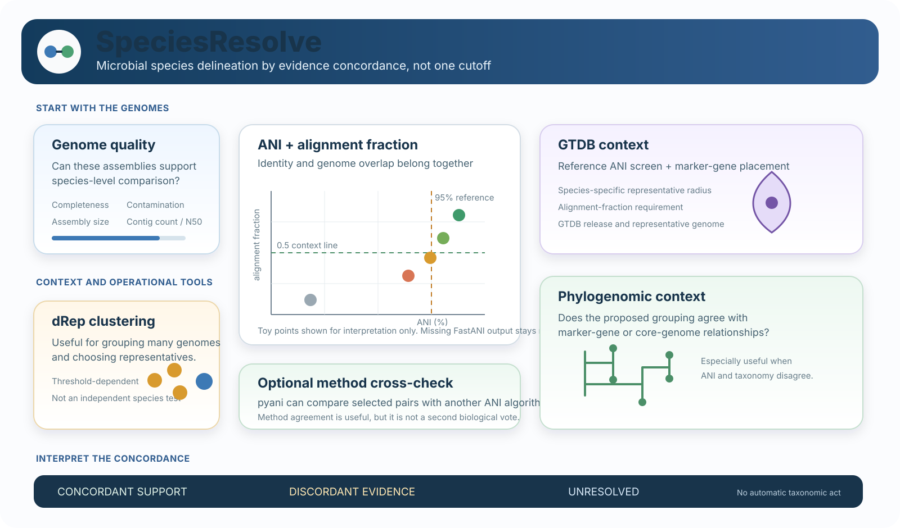

# SpeciesResolve

[](LICENSE)
[]()
[]()
[](https://github.com/mbilal-OU/Genomic-Species-Delineation-Framework/actions)

**SpeciesResolve** is an evidence-aware framework for microbial genome species delineation. It combines ANI, alignment fraction, genome quality, GTDB taxonomic context, dereplication, and phylogenomic placement without reducing species assignment to one cutoff.

> **Core question:** when two or more microbial genomes are compared, how strongly do the available genomic evidence layers support the same species hypothesis, and where do they disagree?

<p align="center">
  
</p>

**Start here:** [Evidence model](docs/EVIDENCE_MODEL.md) · [ANI interpretation](docs/ANI_INTERPRETATION_GUIDE.md) · [Software roles](docs/SOFTWARE_COMPARISON.md)

---

## Species delineation is an evidence problem

ANI is one of the most useful genomic measures for bacterial and archaeal species comparison, but a single ANI value is not a complete species diagnosis.

SpeciesResolve separates the analysis into evidence layers:

| Evidence layer | Main question | SpeciesResolve role |
|---|---|---|
| Genome quality | Are the assemblies reliable enough to compare? | quality gate before interpretation |
| ANI + alignment fraction | How similar are the shared genomic regions, and how much of the genomes participate in that comparison? | primary pairwise genomic evidence |
| GTDB context | Do reference-based species assignment and phylogenomic placement agree with the pairwise result? | taxonomic and placement context |
| dRep clustering | How do many genomes group under explicit ANI and coverage settings? | operational clustering and representative selection |
| pyANI-plus | Does an alternative ANI implementation support the same near-boundary pattern? | optional methodological cross-check |
| Phylogenomic context | Is the proposed grouping compatible with marker-gene or core-genome relationships? | supporting context, especially for discordant cases |

Two cautions matter here:

- **dRep is not an independent biological test of species identity.** Its clusters depend on similarity thresholds and algorithms chosen by the user.
- **pyANI-plus is not automatically more accurate than FastANI.** It provides alternative ANI calculations that can be useful as a method comparison for selected genome pairs.

---

## What 95% ANI means, and what it does not mean

Around **95% ANI** is widely used as a practical reference point for prokaryotic species-level genomic similarity. It should be interpreted as a common genomic circumscription value, not as an infallible universal law.

GTDB species clusters use representative-specific ANI radii. The usual radius is 95%, but some named species use a radius as high as 97%. Current GTDB species assignment also uses an alignment-fraction criterion, so ANI is not interpreted without sufficient genome overlap.

SpeciesResolve therefore avoids labels such as:

```text
ANI >= 95% = definitely same species
ANI < 95%  = definitely different species
```

Instead, it reports the evidence that was actually observed.

### Useful evidence patterns

| Pattern | Interpretation |
|---|---|
| high ANI + substantial alignment fraction + concordant GTDB assignment | strong genomic support for the same species hypothesis |
| high ANI + low alignment fraction | review assembly quality, genome overlap, contamination, and method assumptions |
| ANI close to a species radius | boundary case; inspect reference/type relationships and additional evidence |
| ANI below the common species range | evidence against the same conventional species cluster |
| no FastANI result | unresolved by FastANI; do not convert missing output into an artificial ANI value |
| ANI and GTDB assignment disagree | discordant case requiring review rather than automatic relabeling |

FastANI itself notes that genome pairs much below roughly 80% ANI may produce no ANI output. SpeciesResolve preserves those comparisons as missing.

---

## The three states used by SpeciesResolve

The framework encourages three interpretation states rather than a forced binary answer.

### Concordant support

Multiple evidence layers point in the same direction. For example, ANI and alignment fraction support close genomic relatedness, genome quality is acceptable, and GTDB assignment is consistent.

### Discordant evidence

Evidence layers disagree. Examples include high ANI with conflicting taxonomy, low alignment fraction despite high ANI, or a clustering result that changes substantially under reasonable parameter choices.

### Unresolved

The available evidence is insufficient. Missing ANI, poor genome quality, uncertain reference relationships, or a boundary value can all justify leaving a case unresolved until more evidence is available.

SpeciesResolve does not automatically turn any of these states into a formal taxonomic act.

---

## Quick start

### 1. Clone the repository

```bash
git clone https://github.com/mbilal-OU/Genomic-Species-Delineation-Framework.git
cd Genomic-Species-Delineation-Framework
```

### 2. Create the core environment

```bash
conda env create -f environment.yml
conda activate speciesresolve
```

The core environment contains FastANI, dRep, Python, plotting libraries, and test dependencies. GTDB-Tk is intentionally kept separate because it has a large reference database and substantial memory/storage requirements.

### 3. Run the synthetic toy example

The repository includes **synthetic genomes for software testing and teaching**. They are not biological species claims.

```bash
bash scripts/01_make_fastani_lists.sh
bash scripts/02_run_fastani_all_vs_all.sh
python scripts/08_parse_fastani_and_plot.py
```

Inspect:

```text
example_outputs/fastani/fastani_directional.tsv
example_outputs/fastani/fastani_pairwise_summary.csv
example_outputs/fastani/fastani_ani_matrix.csv
example_outputs/fastani/fastani_alignment_fraction_matrix.csv
figures/fastani_ani_heatmap.png
figures/fastani_pairwise_ani.png
figures/fastani_ani_vs_alignment_fraction.png
```

### 4. Run with your own genomes

Create one path per line:

```bash
find /path/to/genomes -name '*.fna' | sort > genome_list.txt
```

Use the same file for query and reference lists in an all-vs-all comparison:

```bash
fastANI \
  --ql genome_list.txt \
  --rl genome_list.txt \
  -o fastani_all_vs_all.tsv \
  -t 8
```

Then parse it:

```bash
python scripts/08_parse_fastani_and_plot.py \
  --input fastani_all_vs_all.tsv \
  --out-dir results/fastani \
  --fig-dir figures
```

---

## What the FastANI parser now reports

FastANI output contains:

```text
query
reference
ANI
mapped fragments
total query fragments
```

SpeciesResolve calculates:

```text
alignment_fraction = mapped_fragments / total_query_fragments
```

Because FastANI is directional, SpeciesResolve keeps the original directional measurements and also creates an unordered pair summary.

For each genome pair, the summary includes:

```text
mean ANI
minimum ANI
maximum ANI
mean alignment fraction
minimum alignment fraction
number of reported directions
ANI context label
alignment review flag
```

Reciprocal measurements are summarized rather than silently keeping whichever direction happens to have the larger ANI value.

---

## Why alignment fraction matters

ANI measures identity within homologous regions that were successfully compared. It does not by itself tell you how much of the genomes were aligned.

Two genomes can therefore show high identity over a limited shared fraction. That pattern should not be interpreted in the same way as high ANI across extensive genome overlap.

SpeciesResolve keeps ANI and alignment fraction visible together. The pairwise scatter plot is intended to make this distinction obvious.

---

## dRep: what it is actually doing

Use dRep when the question is operational:

```text
How can I cluster many related genomes under explicit similarity settings?
Which representative genome should I retain from each cluster?
```

Example:

```bash
bash scripts/04_run_drep_compare.sh
bash scripts/05_run_drep_dereplicate.sh
```

Important parameters include:

```text
-pa   primary clustering ANI threshold
-sa   secondary clustering ANI threshold
-nc   minimum alignment coverage when supported by the selected algorithm
```

The common `-sa 0.95` setting can be useful for species-like clustering, but it is still a user-defined clustering rule. A dRep cluster should not be treated as an independent proof of species identity.

---

## GTDB-Tk: taxonomic and phylogenomic context

GTDB-Tk classification combines ANI screening against GTDB representative genomes with marker-gene based phylogenetic placement for genomes that require placement.

```bash
gtdbtk classify_wf \
  --genome_dir /path/to/genomes \
  --out_dir gtdbtk_results \
  --extension fna \
  --cpus 16
```

Current GTDB-Tk also exposes a minimum alignment-fraction criterion for species assignment. Keep the GTDB release and GTDB-Tk version with your analysis because reference taxonomy and species representatives change over time.

Treat GTDB assignment as important taxonomic context, not as a replacement for inspecting the underlying ANI, alignment fraction, genome quality, and reference relationship.

---

## pyANI-plus: optional method comparison

The original pyani project is deprecated upstream. SpeciesResolve uses **pyANI-plus** for new alternative-ANI comparisons.

For selected close or boundary pairs, pyANI-plus can provide ANIb, ANIm, dnadiff, or FastANI-based comparisons using alternative workflows.

```bash
bash scripts/03_run_pyani_plus.sh toy_genomes example_outputs/pyani_plus anib
```

The historical `scripts/03_run_pyani.sh` name remains as a compatibility shim and forwards to pyANI-plus.

Use this as a **methodological cross-check**, not as a second independent biological vote.

---

## Genome quality comes first

Poor completeness, contamination, assembly fragmentation, and unusual genome composition can distort similarity estimates and taxonomic placement.

Before species-level interpretation, record at least:

```text
completeness
contamination
assembly size
contig count
N50 or another continuity measure
```

CheckM2 or another justified genome-quality method can be used before SpeciesResolve. The quality thresholds should match the biological material and analysis goal rather than being copied blindly from one project to another.

---

## Synthetic example data

The files in `toy_genomes/` are deliberately constructed test genomes that span several similarity regimes. Their labels are pedagogical and should not be cited as biological species examples.

The toy data are useful for checking that:

- FastANI runs successfully;
- missing distant comparisons remain missing;
- alignment fraction is calculated correctly;
- reciprocal pairs are summarized consistently;
- plots are generated;
- CI can test parser behavior without downloading biological datasets.

See [`toy_genomes/README.md`](toy_genomes/README.md).

---

## Repository structure

```text
SpeciesResolve/
├── README.md
├── CHANGELOG.md
├── CITATION.cff
├── CONTRIBUTING.md
├── environment.yml
├── requirements.txt
├── scripts/
│   ├── 01_make_fastani_lists.sh
│   ├── 02_run_fastani_all_vs_all.sh
│   ├── 03_run_pyani_plus.sh
│   ├── 03_run_pyani.sh             # compatibility shim
│   ├── 04_run_drep_compare.sh
│   ├── 05_run_drep_dereplicate.sh
│   ├── 06_run_gtdbtk_classify_example.sh
│   ├── 08_parse_fastani_and_plot.py
│   └── 09_make_workflow_figure.py
├── docs/
│   ├── EVIDENCE_MODEL.md
│   ├── ANI_INTERPRETATION_GUIDE.md
│   └── SOFTWARE_COMPARISON.md
├── toy_genomes/
├── example_outputs/
├── figures/
└── tests/
```

---

## Validation

GitHub Actions checks:

- Python syntax;
- shell syntax;
- unit tests for FastANI parsing, alignment fraction, missing values, and reciprocal pair summaries.

FastANI, dRep, pyANI-plus, and GTDB-Tk are external tools. Large real-data analyses are a separate validation layer and should record software versions, database releases, input genome quality, and analysis parameters.

---

## Scientific guardrails

- Do not convert missing FastANI output into an invented low ANI value.
- Do not use ANI without considering the amount of genome aligned.
- Do not call dRep clustering independent evidence when it uses ANI-based similarity internally.
- Do not treat pyANI-plus as automatically more precise than FastANI.
- Do not treat a GTDB assignment as a substitute for examining the reference genome and species radius.
- Do not infer formal species status from low-quality or contaminated assemblies.
- Do not use one fixed threshold as a universal species law across all prokaryotic lineages.
- For formal taxonomic descriptions, consider nomenclatural requirements, type material, and additional accepted genomic evidence such as dDDH where appropriate.

---

## References

- Jain C, Rodriguez-R LM, Phillippy AM, Konstantinidis KT, Aluru S. 2018. High throughput ANI analysis of 90K prokaryotic genomes reveals clear species boundaries. *Nature Communications* 9:5114.
- Goris J et al. 2007. DNA-DNA hybridization values and their relationship to whole-genome sequence similarities. *International Journal of Systematic and Evolutionary Microbiology* 57:81-91.
- Richter M, Rossello-Mora R. 2009. Shifting the genomic gold standard for the prokaryotic species definition. *PNAS* 106:19126-19131.
- Olm MR, Brown CT, Brooks B, Banfield JF. 2017. dRep: a tool for fast and accurate genomic comparisons that enables improved genome recovery from metagenomes through de-replication. *ISME Journal* 11:2864-2868.
- Parks DH et al. 2020. A complete domain-to-species taxonomy for Bacteria and Archaea. *Nature Biotechnology* 38:1079-1086.

## Citation

Citation metadata are provided in [`CITATION.cff`](CITATION.cff). Please also cite each external program used in the final analysis.

## License

MIT. See [`LICENSE`](LICENSE).
